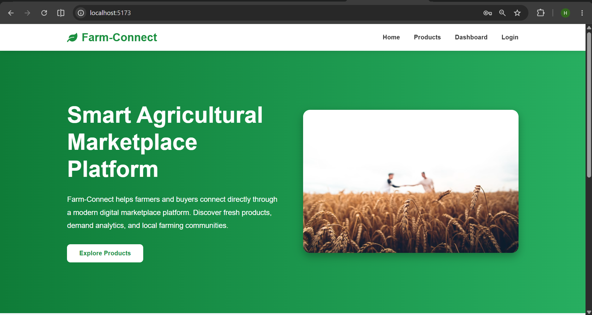
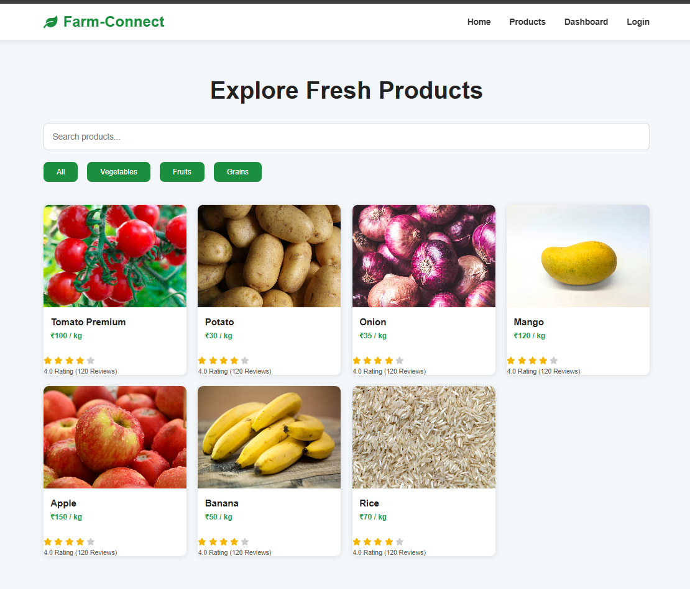
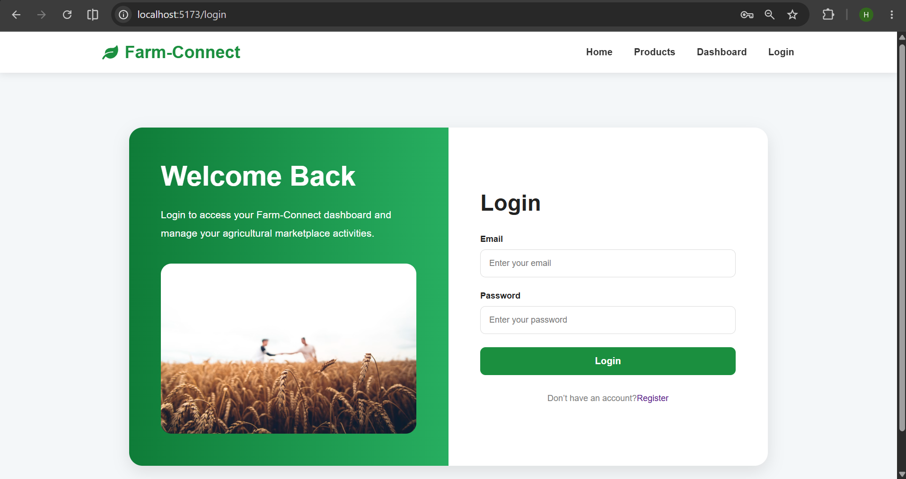
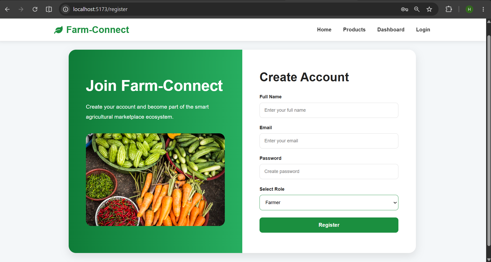
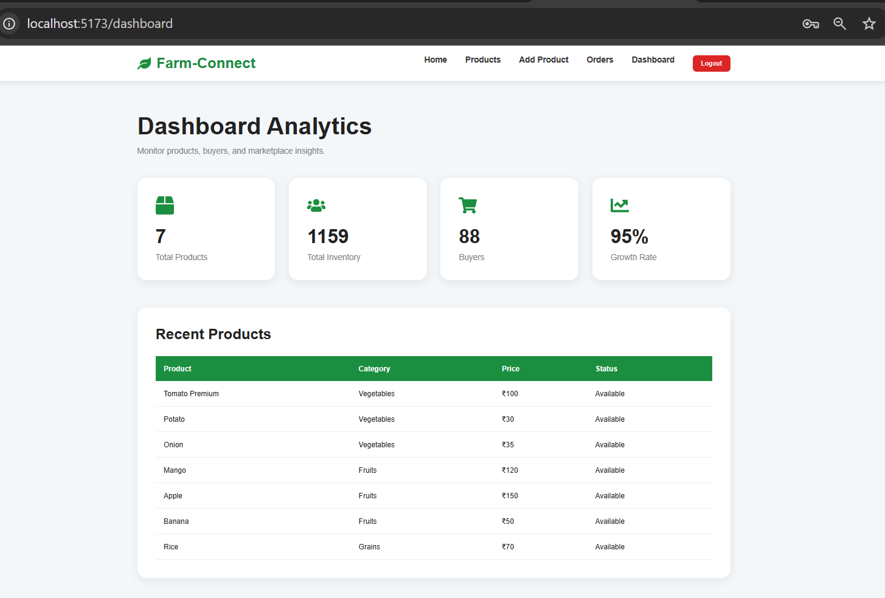
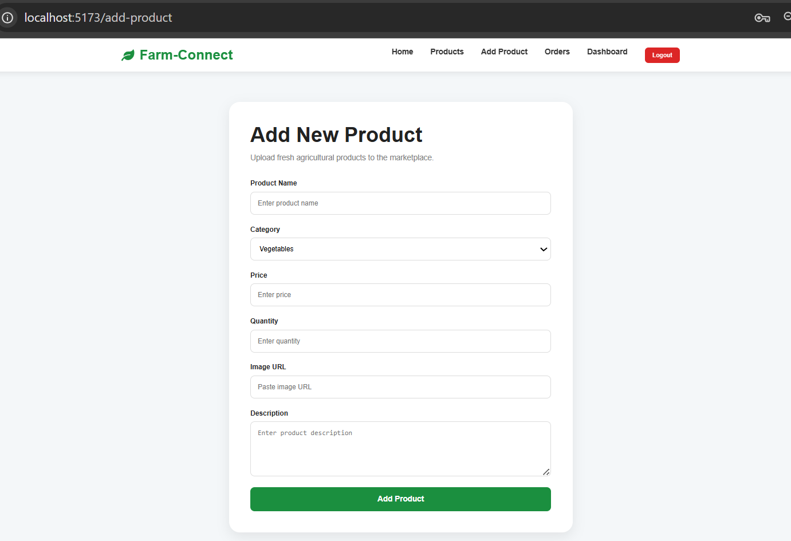
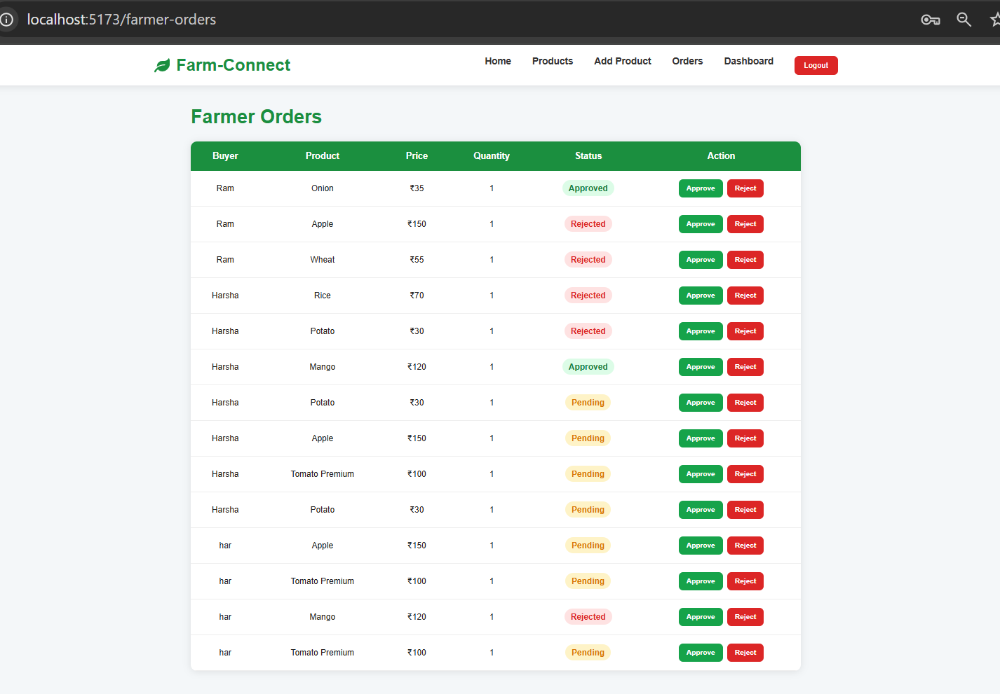
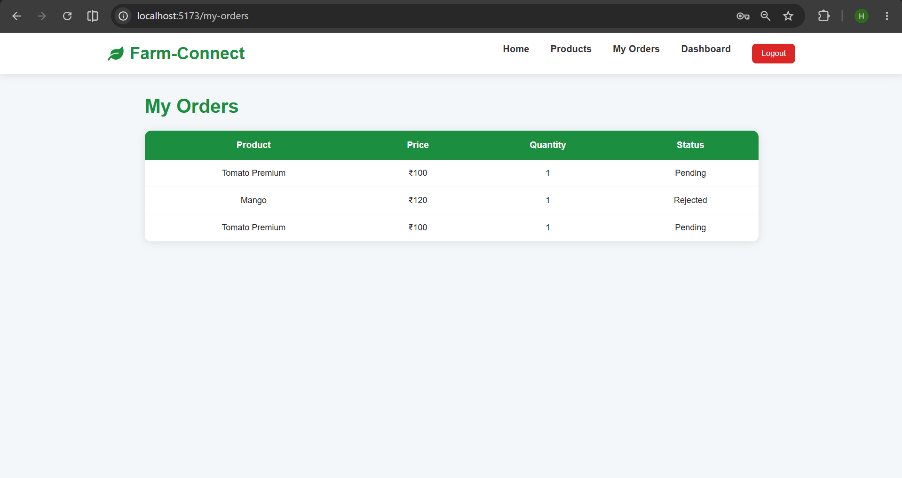
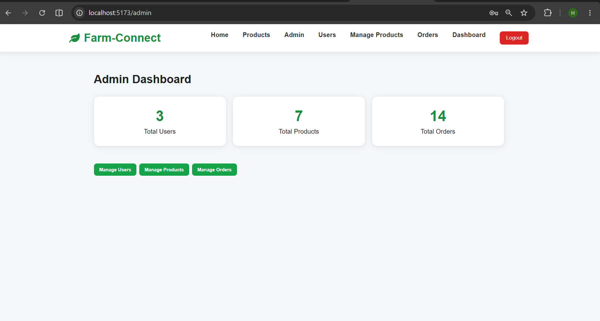

# 🌱 Farm-Connect

Farm-Connect is a Full Stack Agricultural Marketplace Platform that connects farmers and buyers directly through a secure digital marketplace.

## 🚀 Features

### Buyer
- Register and Login
- Browse Products
- Search and Filter Products
- Place Orders
- View My Orders
- JWT Authentication

### Farmer
- Register and Login
- Add Products
- Edit Products
- Delete Products
- Manage Orders
- Approve/Reject Orders

### Admin
- Manage Users
- Manage Products
- Manage Orders
- Dashboard Analytics

## 🛠️ Tech Stack

### Frontend
- React.js
- React Router
- Axios
- CSS3

### Backend
- Spring Boot
- Spring Security
- JWT Authentication
- REST APIs

### Database
- MySQL

## 🔐 Security

- JWT Authentication
- Role Based Access Control
- Protected Routes
- Secure API Access

## 📂 Project Structure

```
Farm-Connect
│
├── frontend
│   ├── React
│   └── CSS
│
├── backend
│   ├── Spring Boot
│   ├── JWT Security
│   └── REST APIs
│
└── MySQL Database
```

## 📸 Screenshots

### Home Page


### Products Page


### Login Page


### Register Page


### Dashboard


### Add Product


### Farmer Orders


### My Orders


### Admin Dashboard


## 👨‍💻 Author

Harshavardhan S V
